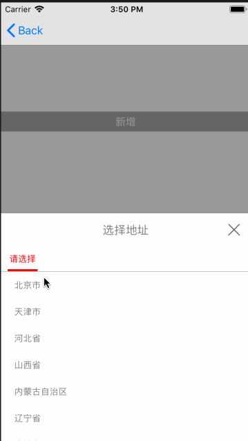

# ZHFJDAddressOC
### 这是一个自定义仿京东地址选择器--OC版本（保证集成成功，有不懂的地方可加QQ：991150443 进行讨论。）

 
 

Swift版本地址：

`
https://github.com/FighterLightning/ZHFJDAddress.git

---
#### Demo的使用须知:
 1. 下载该demo。把Address文件拖进项目（里面有一个View（主要），五个model（一个网络，剩下省、市、区、乡镇））

 2. 在 Podfile 中添加:
 * `pod 'AFNetworking'`
 
 * `pod 'YYModel'`
 	
 3. 网络请求看ZHFAddTitleAddressView.m头部注释根据需求进行修改
 
 
# PS

 如果感觉有帮助，不要吝啬你的星星哦！
 该demo地址：
 
 `
 https://github.com/FighterLightning/ZHFJDAddressOC.git
